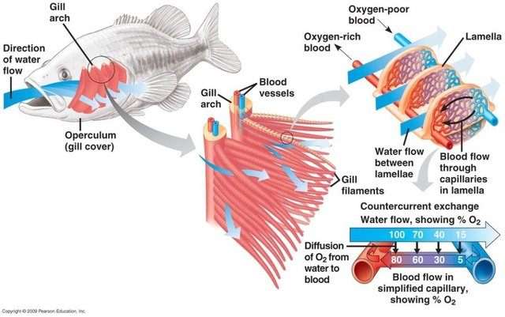

# Conclusion

These notes took a relatively high level perspective on the modeling of testing data. 

Right before the covid-19 pandemic occurred,  our lab was about to launch a study with two collaborators (critical care doctors) on survivors of ARDS. Patients can take up to a year to recover from ARDS, even getting up from a chair can make these survivors winded. I had been learning a lot about ARDS when the pandemic started. One key piece of information I picked up from one of our collaborators ([Jack Iwashyna](https://ihpi.umich.edu/our-experts/tiwashyn)) is that the human lung is a poorly designed system. If we wanted to design a way to bring oxygen into our body, process it, and eliminate the waste product, CO2, we wouldn't have a designed what is essentially a sac where good air comes in from the top and the bad air goes out the same way the good air came in.  An inhalation brings O2 in, an exhalation forces CO2 out.  If the "sac" fills with liquid or is affected by inflammation, we can experience major complications. The [gills](https://en.wikipedia.org/wiki/Fish_gill) in fish are more efficient than our lungs for processing oxygen: as water flows through,  the gills extract O2. Unfortunately, when the pandemic is over there will be a large pool of ARDS survivors that we will be able to recruit into our study.

 
(from [Kumar, Gandhi and Majumder](https://arxiv.org/pdf/1805.07744.pdf))
